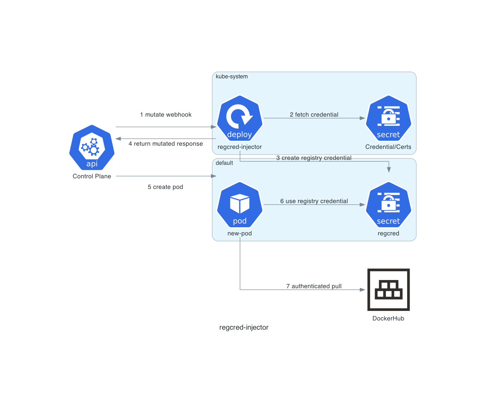

# regcred-injector

regcred-injector is a Kubernetes admission controller which allows you to
globally set a registry credential.

This is achieved by hooking into pod creation and mutating the pod with
an `imagePullSecrets` entry. This is currently limited to adding a single
`imagePullSecret`.

Along with mutating the pod, credentials will be created in the target namespace,
provided they don't already exist.

## Limitations

regcred-injector does not yet support overriding credentials in existing
namespaces. That is, if regcred creates a secret and the registry PAT is
changed, namespaces will not automatically receive the new credentials and
they must be manually removed to be updated.

regcred-injector has no way to skip injection of credentials, all namespaces
will receive the registry secrets as pods are created.

## Usage

Installation into a Kubernetes cluster is possible with helm. Required parameters are the docker username and password (PAT), as well as a self-signed TLS keypair which Kubernetes uses to authenticate with the deployed service.

`helm install --set docker.username=<username>  --set docker.password=<PAT> my-release chart`

Installation with a Scaleway private registry.

`helm install --set docker.username=<accesskey>  --set docker.password=<secretkey> --set docker.registry=rg.fr-par.scw.cloud --set-file cert=certs/regcred-injector-crt.pem --set-file key=certs/regcred-injector-key.pem my-release chart`
